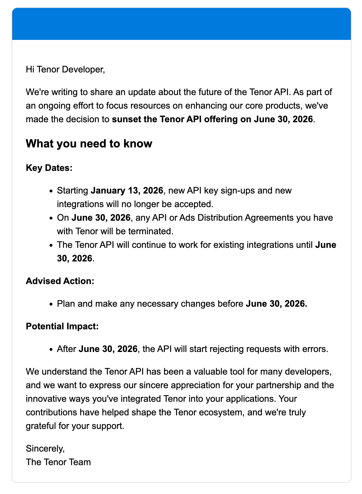

# source-gif

> [!WARNING]
> **DEPRECATION WARNING**: This module uses the Tenor API which is being sunset on **June 30, 2026**. Do not use this module for new integrations. If you are currently using this module, you must migrate to an alternative GIF provider before the deprecation date.

## Overview

This module provides GIF search functionality for the WordPress MediaPicker library using the [Tenor API](https://tenor.com/). It implements the `MediaSource` interface to allow users to search and select GIFs within the media picker.

## Tenor API Deprecation

Google has announced the sunset of the Tenor API:



Here are the key dates:

| Date | Impact |
|------|--------|
| **January 13, 2026** | New API key sign-ups and new integrations will no longer be accepted |
| **June 30, 2026** | All API and Ads Distribution Agreements with Tenor will be terminated |
| **After June 30, 2026** | The API will start rejecting all requests with errors |

### What This Means

- **New integrations**: If you haven't already integrated this module, do not use it. The Tenor API no longer accepts new API key registrations.
- **Existing integrations**: You must plan and implement a migration to an alternative GIF provider before June 30, 2026.

## Migration Recommendations

Consider migrating to one of these alternative GIF providers:

- [GIPHY API](https://developers.giphy.com/) - Popular GIF platform with comprehensive API
- [Gfycat API](https://developers.gfycat.com/) - High-quality GIF and video clips

### Migration Steps

1. Choose an alternative GIF provider
2. Update this module to use the new provider's API instead of Tenor
3. Replace the Tenor API key with the new provider's API key
4. Update Tenor references in the parent `mediapicker` module:
    - `src/main/res/menu/media_picker_lib_menu.xml` - menu item ID `mnu_choose_from_tenor_library`
    - `src/main/java/org/wordpress/android/mediapicker/ui/MediaPickerFragment.kt` - references to `tenorLibraryMenuItem`
    - `src/main/res/values/strings.xml` - string `photo_picker_gif` with value "Choose from Tenor"
5. Test thoroughly before the deprecation date

## Module Structure

```
source-gif/
├── GifMediaDataSource.kt    # MediaSource implementation for GIF search
├── GifMediaPickerSetup.kt   # MediaPicker configuration for GIF source
├── GifSourceModule.kt       # Hilt dependency injection module
├── TenorApiKey.kt           # API key qualifier annotation
├── TenorGifClient.kt        # Tenor API client wrapper
└── util/
    └── NetworkUtilsWrapper.kt
```

## Dependencies

This module requires:

- `tenor-android-core-jetified` - Jetified Tenor GIF library (bundled as AAR)
- `mediapicker:domain` - Core MediaPicker domain module

## License

See the [LICENSE](../../LICENSE) file in the repository root.
